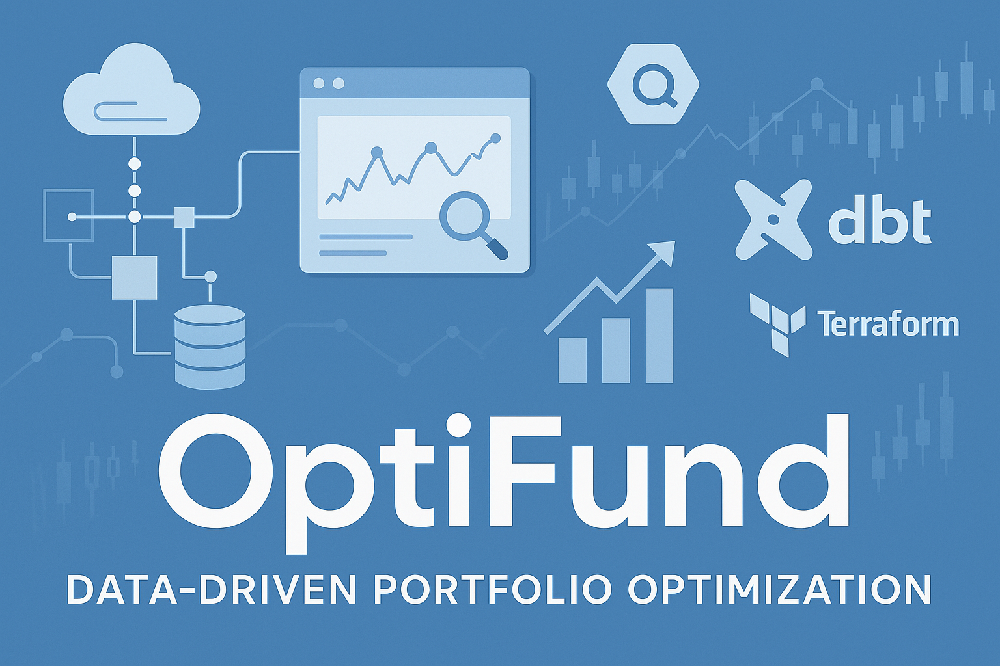
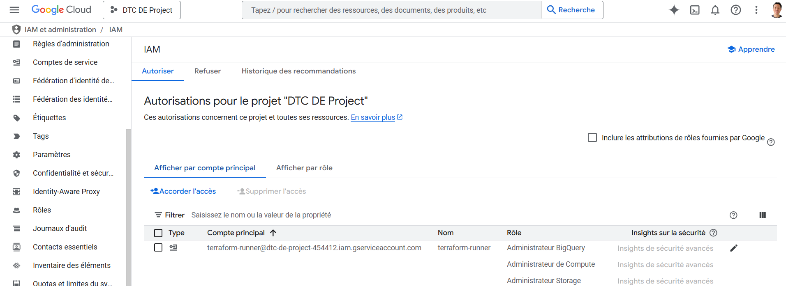
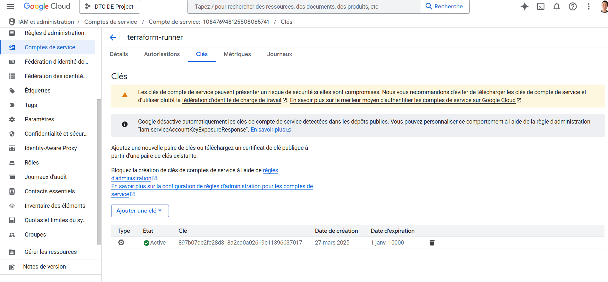
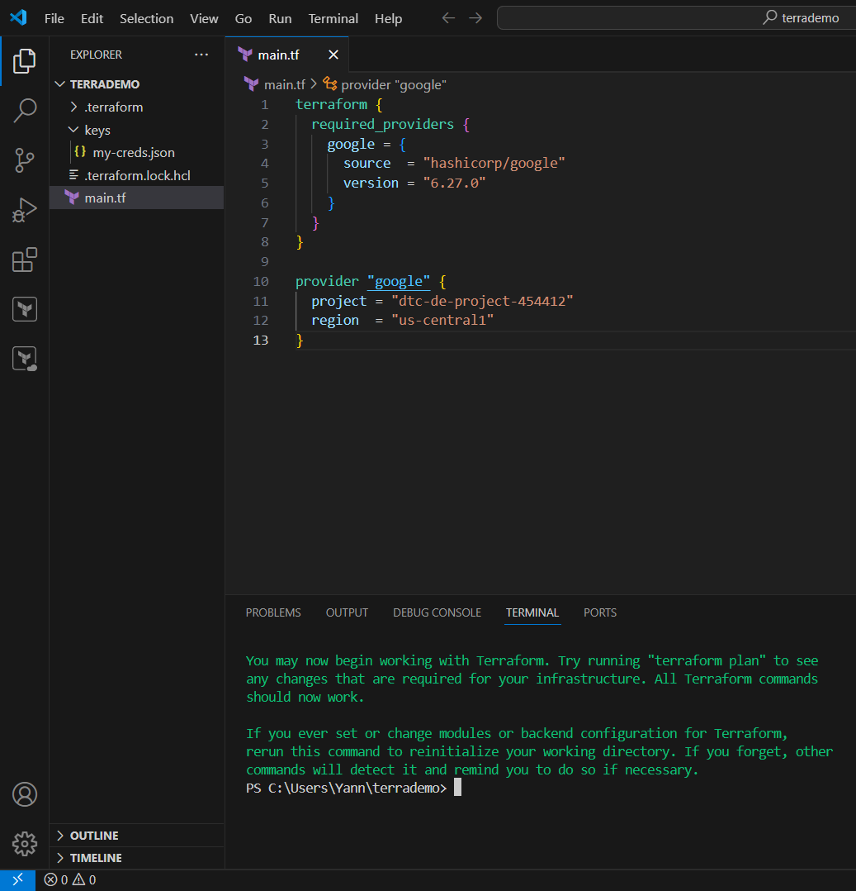
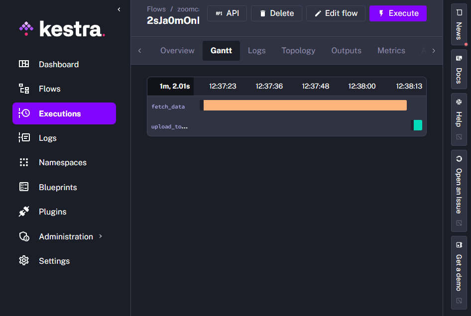
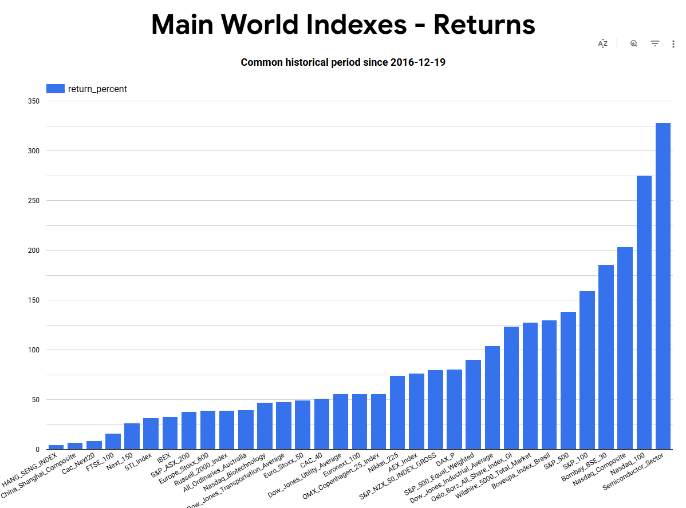
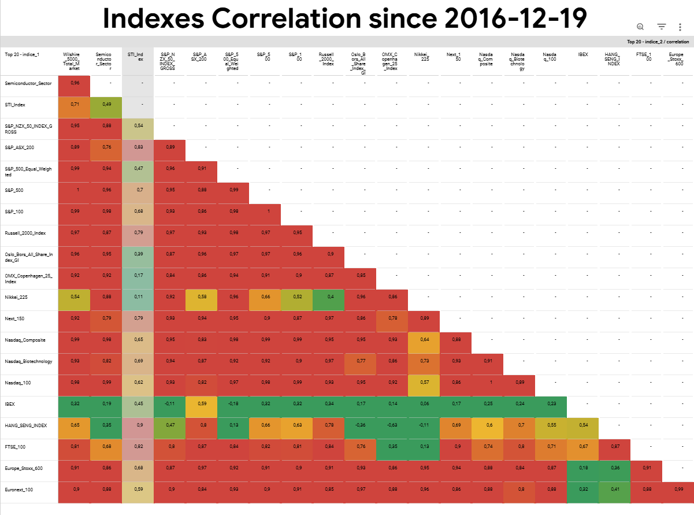

# OptiFund : Data-Driven Portfolio Optimization

This project aims to build a reproducible data pipeline to collect, transform, and analyze main market indexes data in order to identify the best-performing and least-correlated assets.  
It leverages batch orchestration with Kestra, infrastructure-as-code with Terraform, cloud storage (GCS), and transformation logic with dbt and BigQuery.


## 🧠 Project Overview

**OptiFund** is a data engineering project aiming to build an optimized portfolio from the main world indexes.  
Using historical daily data, the pipeline identifies top-performing assets and removes highly correlated ones to maximize diversification and return.

## 🔧 Tech Stack

- **Kestra** for orchestration
- **Google Cloud Platform** (GCS, BigQuery)
- **Terraform** for infrastructure as code
- **dbt** for analytics transformations
- **Looker Studio** for dashboard visualization
- **yfinance** for data ingestion

## 📁 Project Structure

```bash
├── notebooks/              # Testing Data ingestion using yfinance
├── terraform/              # Infrastructure setup on GCP
├── orchestration_kestra/   # Kestra flows for orchestration
├── dbt_optifund/           # dbt transformations and models
└── README.md               # Project documentation
```

## 📊 Key Results

- Correlation matrix of top assets
- Portfolio construction excluding overlapping assets
- Interactive dashboard with filters by return/correlation

## 🚀 Try It

View the dashboard on Looker Studio ([link here](https://lookerstudio.google.com/reporting/3c99e91f-961a-4504-8187-91c88275a8d5))

## 📌 Status

✅ Ingestion
✅ Orchestration
✅ BigQuery pipeline
🟡 Correlation-based selection (enhancing the sort by return)
🟢 Final dashboard in progress

## 🚀 Reproducibility

This project has been designed to be easily reproducible by following the steps below.

### 1. Prerequisites

- Google Cloud account with billing enabled

- Enabled APIs:
  - BigQuery
  - Cloud Storage
  - Service Account

- A project created in GCP (this project uses the `EU` multi-region)
- Requirements :
  - Python 3.12 (Python dependances declared in `Pipfile`)
  - `pipenv` installed globally
  ```bash
  pip install pipenv
  pipenv shell
  ```
  - Kestra (via Docker Compose)
  - Terraform 1.6.x
  - dbt-core 1.7.x
  - BigQuery

### 2. Clone the repository

```bash
git clone https://github.com/YannPhamVan/OptiFund-Data-Driven-Portfolio-Optimization.git
cd OptiFund-Data-Driven-Portfolio-Optimization
```

### 3. Infrastructure setup (Terraform)

Go to the terraform folder and apply the infrastructure:
```bash
cd terraform
terraform init
terraform apply
```
This creates:

- A Cloud Storage bucket for raw data
- A BigQuery dataset for the analytics layer
- A service account (key not committed)

⚠️ Create a file named `keys/my-creds.json` in the terraform folder with your own GCP credentials.

### 4. Data ingestion (Kestra)

The ingestion pipeline is orchestrated with [Kestra](https://kestra.io/).
You can view the flow in `orchestration_kestra/flows/` folder.

To start Kestra:
```bash
cd ../orchestration_kestra
docker compose up -d
```
Then open your browser at: http://localhost:8080

To stop Kestra:
```bash
docker compose down
```
**ℹ️ Kestra workflows are located in the `orchestration_kestra/flows/` folder. These manage the ingestion and loading of stock data into GCS and BigQuery.**

Once Kestra is installed and running locally (via Docker), launch the flow directly from the UI or using the CLI.

The flow:
- Calls `yfinance` to collect daily closing prices of indexes (Daily execution at 00:00 UTC via trigger)
- Saves the files in Cloud Storage
- Loads the data into BigQuery


### 5. Data transformation (dbt)

Navigate to the `dbt_optifund` folder, then run the dbt pipeline:
```bash
cd ../dbt_optifund
dbt debug
dbt deps
dbt run --select cumulative_returns
dbt run --select correlation_matrix
```
This will transform the raw data, compute returns and correlations, and prepare the final models for analysis.

### 6. Dashboard (Looker Studio)

A Looker Studio dashboard is available [here](https://lookerstudio.google.com/reporting/3c99e91f-961a-4504-8187-91c88275a8d5)

It includes:
- An overview of the best-performing stocks
- A correlation matrix
- Portfolio composition visuals

**Dashboard Overview**




Feel free to adapt paths or commands depending on your setup.